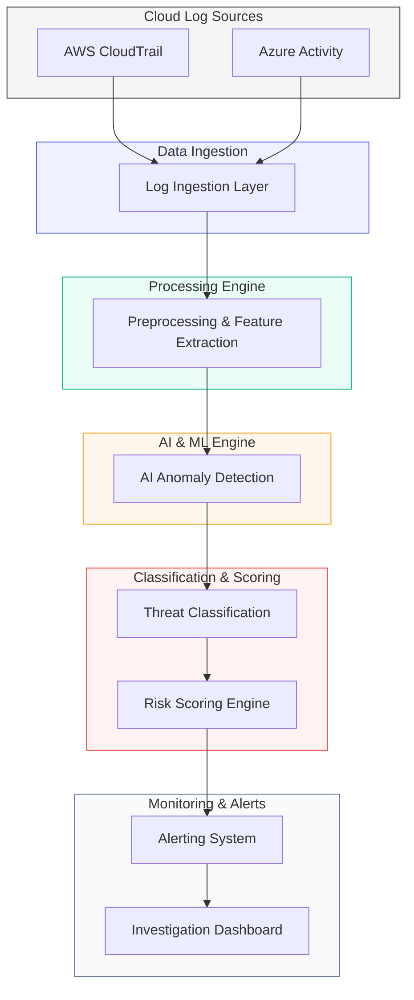

# ThreatHunter
### AI-Based Cloud Security Threat Hunting Platform

[](https://opensource.org/licenses/MIT)
[](https://www.python.org/downloads/)
[](https://fastapi.tiangolo.com/)

**ThreatHunter** is a professional-grade, AI-powered security platform designed to automatically analyze cloud activity logs and identify potential security threats without manual intervention. It establishes behavioral baselines and detects anomalies using advanced machine learning.

---

## 🚀 Overview

Modern cloud environments generate massive volumes of activity logs. Security teams often struggle to manually analyze this data to find subtle threats like lateral movement or data exfiltration. **ThreatHunter** solves this by providing an automated, AI-driven detection pipeline that ingests, cleans, analyzes, and classifies security events in near real-time.

---

## ✨ Key Features

-   **📡 Multi-Cloud Ingestion**: Automated collection and normalization of AWS CloudTrail and Azure Activity logs.
-   **🤖 AI Anomaly Detection Engine**: Uses unsupervised machine learning (Isolation Forest) to detect behavioral outliers.
-   **🏷️ Intelligent Threat Classification**: Maps detected anomalies to specific TTPs (Tactics, Techniques, and Procedures).
-   **⚖️ Dynamic Risk Scoring**: Context-aware severity assessment with priority tiering (Low, Medium, High, Critical).
-   **🖥️ Investigation Dashboard**: Modern, glassmorphism-inspired UI for real-time monitoring and forensic analysis.

---

## 🏗️ System Architecture

The following diagram illustrates the high-level data flow through the ThreatHunter platform:



For more detailed information, see our [Architecture Documentation](docs/architecture.md).

---

## 🛠️ Technology Stack

| Layer | Technologies |
| :--- | :--- |
| **Backend** | Python 3.8+, FastAPI, Uvicorn |
| **Data Analysis** | Scikit-Learn (Isolation Forest), Pandas, Numpy |
| **Storage** | SQLite3 (Persistent Metadata) |
| **Frontend** | HTML5, CSS3 (Modern Glassmorphism), JavaScript (Vanilla) |
| **Testing** | Postman, Manual Validation |

---

## 📁 Project Structure

```bash
ThreatHunter/
├── docs/             # Technical Documentation
│   ├── architecture.md
│   ├── log_ingestion.md
│   ├── anomaly_detection.md
│   ├── threat_classification.md
│   └── investigation_dashboard.md
├── backend/          # Python AI and log processing modules
│   ├── main.py       # API Entry Point
│   ├── ingestion.py  # Data Intake
│   ├── ai_engine.py  # ML Scoring logic
│   ├── classifier.py # Risk assessment
│   └── database.py   # SQL persistence
├── frontend/         # Dashboard UI
│   ├── index.html    # Layout
│   ├── styles.css    # Aesthetics
│   └── app.js        # Logic
├── data/             # Sample Log datasets
├── diagrams/         # Architectural Visuals
└── screenshots/      # UI Previews
```

---

## 🏁 Getting Started

### Installation
1.  **Clone the Repository**:
    ```bash
    git clone https://github.com/YourUsername/ThreatHunter.git
    cd ThreatHunter
    ```
2.  **Install Dependencies**:
    ```bash
    pip install fastapi uvicorn
    ```

### Running the Platform
1.  **Start the Backend API**:
    ```bash
    python backend/main.py
    ```
2.  **View the Dashboard**:
    Open `frontend/index.html` in your browser.

---

## 🔮 Future Improvements

-   [ ] **Real-time API Hooking**: Directly integrate with AWS CloudWatch and Azure Monitor APIs.
-   [ ] **GPU Acceleration**: Implement deep learning models for sequence-based anomaly detection.
-   [ ] **Multi-user RBAC**: Role-based access control for different tiers of security analysts.
-   [ ] **Containerization**: Full Docker/Kubernetes deployment configurations.

---
*Maintained by the ThreatHunter Community. Licensed under the MIT License.*
